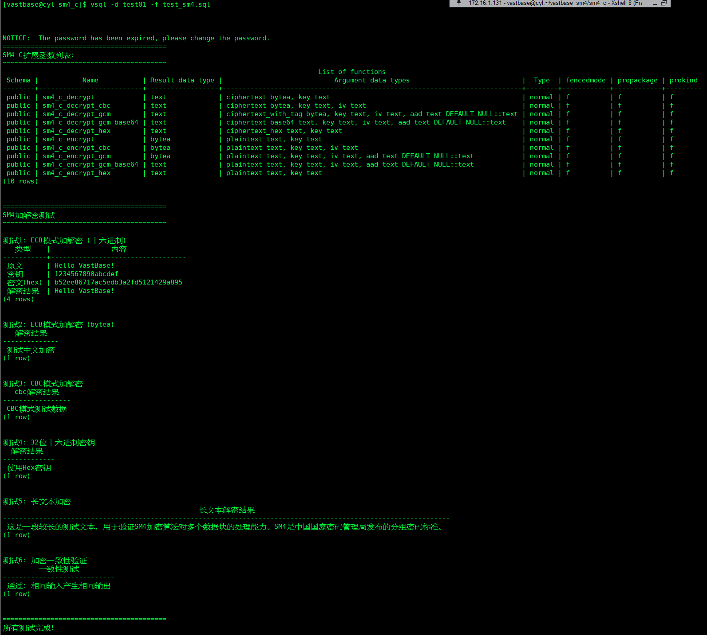
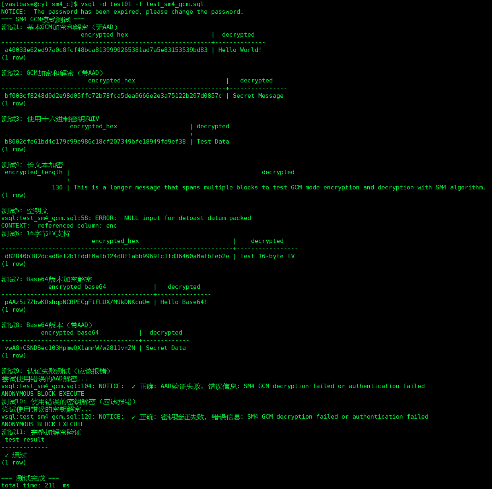
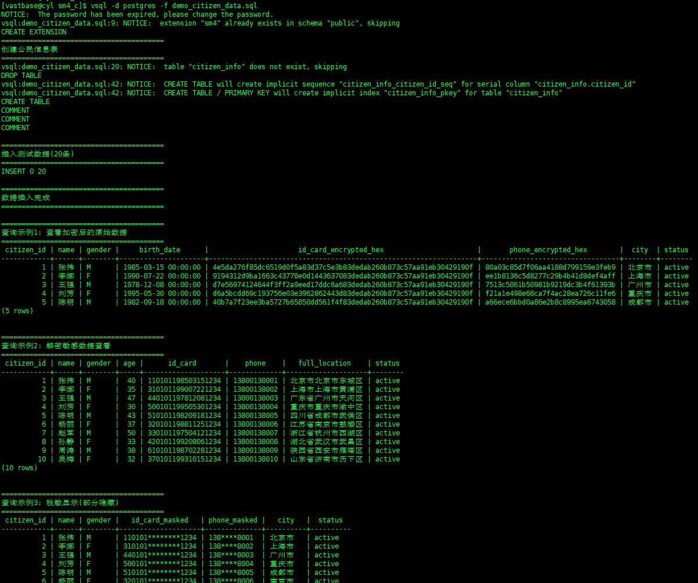

# SM4 Extension for VastBase

国密SM4分组密码算法扩展，基于GB/T 32907-2016标准实现。

## 文件结构

```text
├── sm4.h                      # SM4算法头文件
├── sm4.c                      # SM4算法实现
├── sm4_ext.c                  # VastBase扩展接口
├── sm4.control                # 扩展控制文件
├── sm4--1.0.sql               # SQL函数定义
├── Makefile                   # 编译配置（已启用OpenSSL KDF支持）
├── test_sm4.sql               # ECB/CBC测试脚本
├── test_sm4_gcm.sql           # GCM模式测试脚本
├── test_sm4_cbc_kdf.sql       # CBC KDF模式测试脚本
├── test_sm4_gs_compat.sql     # GS格式兼容性测试脚本
├── demo_citizen_data.sql      # 示例数据
└── README.md                  # 使用文档（本文件）
```

## 编译安装

**前置条件**: 需要安装 OpenSSL 开发库（1.1.1+ 或 3.0+）

```bash
# 检查 OpenSSL 版本
openssl version

# 如果需要安装 OpenSSL 开发库
# CentOS/RHEL: sudo yum install openssl-devel
# Ubuntu/Debian: sudo apt-get install libssl-dev
```

```bash
# 进入代码目录(根据实际调整用户和目录)
# 把vastbase_sm4上传到Vastbase数据库服务器，并授权所有者为数据库用户

su - vastbase
cd /home/vastbase/vastbase_sm4/sm4_c

# 设置环境变量
export VBHOME=/home/vastbase/vasthome # 根据实际调整
export PATH=$VBHOME/bin:$PATH
export LD_LIBRARY_PATH=$VBHOME/lib:$LD_LIBRARY_PATH

# 编译（已启用 OpenSSL KDF 支持）
make clean
make

# 安装
make install

# 复制.so到proc_srclib目录
mkdir -p /home/vastbase/vasthome/lib/postgresql/proc_srclib
cp /home/vastbase/vasthome/lib/postgresql/sm4.so /home/vastbase/vasthome/lib/postgresql/proc_srclib/

# 重启数据库加载新扩展
vb_ctl restart
```

## 启用扩展

VastBase不支持EXTENSION语法，需直接执行SQL创建函数。

**注意**: 函数是数据库级别对象，需在每个要使用的数据库中单独创建。.so文件是共享的，只需安装一次。

```bash
# 在postgres库中创建函数
vsql -d postgres -f /home/vastbase/vasthome/share/postgresql/extension/sm4--1.0.sql

# 在vastbase库中创建函数
vsql -d vastbase -f /home/vastbase/vasthome/share/postgresql/extension/sm4--1.0.sql

# 在其他库中创建...
vsql -d test01 -f /home/vastbase/vasthome/share/postgresql/extension/sm4--1.0.sql
```

或手动执行（可选）：

```sql
-- 连接数据库
vsql -d test01 -r

-- 创建SM4函数 (使用sm4_c_前缀避免与Java UDF冲突)
CREATE OR REPLACE FUNCTION sm4_c_encrypt(plaintext text, key text)
RETURNS bytea AS 'sm4', 'sm4_encrypt' LANGUAGE C STRICT IMMUTABLE;

CREATE OR REPLACE FUNCTION sm4_c_decrypt(ciphertext bytea, key text)
RETURNS text AS 'sm4', 'sm4_decrypt' LANGUAGE C STRICT IMMUTABLE;

CREATE OR REPLACE FUNCTION sm4_c_encrypt_hex(plaintext text, key text)
RETURNS text AS 'sm4', 'sm4_encrypt_hex' LANGUAGE C STRICT IMMUTABLE;

CREATE OR REPLACE FUNCTION sm4_c_decrypt_hex(ciphertext_hex text, key text)
RETURNS text AS 'sm4', 'sm4_decrypt_hex' LANGUAGE C STRICT IMMUTABLE;

CREATE OR REPLACE FUNCTION sm4_c_encrypt_cbc(plaintext text, key text, iv text)
RETURNS bytea AS 'sm4', 'sm4_encrypt_cbc' LANGUAGE C STRICT IMMUTABLE;

CREATE OR REPLACE FUNCTION sm4_c_decrypt_cbc(ciphertext bytea, key text, iv text)
RETURNS text AS 'sm4', 'sm4_decrypt_cbc' LANGUAGE C STRICT IMMUTABLE;

CREATE OR REPLACE FUNCTION sm4_c_encrypt_gcm(plaintext text, key text, iv text, aad text DEFAULT NULL)
RETURNS bytea AS 'sm4', 'sm4_encrypt_gcm' LANGUAGE C IMMUTABLE;

CREATE OR REPLACE FUNCTION sm4_c_decrypt_gcm(ciphertext_with_tag bytea, key text, iv text, aad text DEFAULT NULL)
RETURNS text AS 'sm4', 'sm4_decrypt_gcm' LANGUAGE C IMMUTABLE;

CREATE OR REPLACE FUNCTION sm4_c_encrypt_cbc_kdf(plaintext text, password text, hash_algo text)
RETURNS bytea AS 'sm4', 'sm4_encrypt_cbc_kdf' LANGUAGE C STRICT IMMUTABLE;

CREATE OR REPLACE FUNCTION sm4_c_decrypt_cbc_kdf(ciphertext bytea, password text, hash_algo text)
RETURNS text AS 'sm4', 'sm4_decrypt_cbc_kdf' LANGUAGE C STRICT IMMUTABLE;
```

## 停用扩展

如果需要删除SM4扩展函数，执行以下命令：

```sql
-- 连接数据库
vsql -d test01 -r

-- 删除所有SM4 C扩展函数
DROP FUNCTION IF EXISTS sm4_c_encrypt(text, text);
DROP FUNCTION IF EXISTS sm4_c_decrypt(bytea, text);
DROP FUNCTION IF EXISTS sm4_c_encrypt_hex(text, text);
DROP FUNCTION IF EXISTS sm4_c_decrypt_hex(text, text);
DROP FUNCTION IF EXISTS sm4_c_encrypt_cbc(text, text, text);
DROP FUNCTION IF EXISTS sm4_c_decrypt_cbc(bytea, text, text);
DROP FUNCTION IF EXISTS sm4_c_encrypt_gcm(text, text, text, text);
DROP FUNCTION IF EXISTS sm4_c_decrypt_gcm(bytea, text, text, text);
DROP FUNCTION IF EXISTS sm4_c_encrypt_cbc_kdf(text, text, text);
DROP FUNCTION IF EXISTS sm4_c_decrypt_cbc_kdf(bytea, text, text);
```

**注意**：

- 删除函数不会删除.so文件，只是在当前数据库中移除函数定义
- 如需在多个数据库中删除，需要分别连接每个数据库执行删除命令
- 如果要完全卸载扩展，还需要删除.so文件：

  ```bash
  rm -f /home/vastbase/vasthome/lib/postgresql/sm4.so
  rm -f /home/vastbase/vasthome/lib/postgresql/proc_srclib/sm4.so
  ```

## 查看已安装的函数

```sql
vsql -d test01

-- 查看所有SM4 C扩展函数
\df sm4_c*

-- 查看函数详细信息
\df+ sm4_c_encrypt
```

## 函数说明

**重要提示**: 为避免VastBase中与Java UDF函数名冲突，所有C扩展函数均使用 `sm4_c_` 前缀。

| 函数                                           | 说明                              |
| ---------------------------------------------- | --------------------------------- |
| `sm4_c_encrypt(text, key)`                     | ECB模式加密，返回bytea            |
| `sm4_c_decrypt(bytea, key)`                    | ECB模式解密，返回text             |
| `sm4_c_encrypt_hex(text, key)`                 | ECB模式加密，返回十六进制字符串   |
| `sm4_c_decrypt_hex(hex, key)`                  | ECB模式解密，输入十六进制密文     |
| `sm4_c_encrypt_cbc(text, key, iv)`             | CBC模式加密，返回bytea            |
| `sm4_c_decrypt_cbc(bytea, key, iv)`            | CBC模式解密，返回text             |
| `sm4_c_encrypt_cbc_kdf(text, password, algo)`  | **CBC+KDF加密**，支持密钥派生 🔥  |
| `sm4_c_decrypt_cbc_kdf(bytea, password, algo)` | **CBC+KDF解密**，支持密钥派生 🔥  |
| `sm4_c_encrypt_cbc_gs(text, password, algo)`   | **兼容gs_encrypt格式加密** 🎯     |
| `sm4_c_decrypt_cbc_gs(text, password)`         | **兼容gs_encrypt格式解密** 🎯     |
| `sm4_c_encrypt_gcm(text, key, iv, aad)`        | GCM模式加密，返回密文+Tag(bytea)  |
| `sm4_c_decrypt_gcm(bytea, key, iv, aad)`       | GCM模式解密，返回text             |
| `sm4_c_encrypt_gcm_base64(text, key, iv, aad)` | GCM模式加密，返回Base64编码(text) |
| `sm4_c_decrypt_gcm_base64(text, key, iv, aad)` | GCM模式解密，接收Base64编码(text) |

**密钥格式**: 16字节字符串 或 32位十六进制字符串

**IV格式**:

- CBC模式: 16字节字符串 或 32位十六进制字符串
- GCM模式: 12或16字节字符串 或 24/32位十六进制字符串（推荐12字节）

### 🔥 新增：CBC KDF（密钥派生）模式

**特性**：
- ✅ 使用 PBKDF2 从密码派生密钥和IV（10,000次迭代）
- ✅ 支持 SHA256/SHA384/SHA512/SM3 哈希算法
- ✅ 自动生成随机盐值，增强安全性
- ✅ 无需手动管理密钥和IV，简化使用

**参数说明**：
- `password`: 任意长度的密码（text）
- `hash_algo`: 哈希算法，可选值：
  - `'sha256'` - SHA-256（推荐，OpenSSL 1.1.1+）
  - `'sha384'` - SHA-384（OpenSSL 1.1.1+）
  - `'sha512'` - SHA-512（OpenSSL 1.1.1+）
  - `'sm3'` - SM3 国密哈希（需要 OpenSSL 3.0+）

**输出格式**：`[盐值 16字节] + [SM4 CBC 密文]`

### ❓ 常见问题

**Q1: SM3 算法不可用怎么办？**
- 需要 OpenSSL 3.0+ 或 GmSSL
- 检查: `openssl version`
- 如果版本较低，使用 SHA256/384/512 替代

**Q2: 密钥派生性能影响？**
- PBKDF2 10,000 次迭代约需 10-50ms
- 比标准 CBC 慢约 10-20 倍
- 适合需要密码保护的场景

**Q3: 为什么每次加密结果不同？**
- 因为每次生成的随机盐值不同
- 这是安全特性，防止彩虹表攻击

### 🎯 新增：兼容 VastBase gs_encrypt 格式

**特性**：
- ✅ 完全兼容 VastBase `gs_encrypt` 函数格式
- ✅ 支持 SHA256/SHA384/SHA512/SM3 哈希算法
- ✅ Base64 编码输出，与数据库一致
- ✅ 自动识别算法类型，无需指定
- ✅ 可解密 `gs_encrypt` 加密的数据

**函数说明**：
```sql
-- 加密（需指定哈希算法）
sm4_c_encrypt_cbc_gs(plaintext, password, hash_algo) -> text (Base64)

-- 解密（自动识别算法）
sm4_c_decrypt_cbc_gs(ciphertext_base64, password) -> text
```

**数据格式**：
```
Base64([版本号 1字节] + [算法类型 1字节] + [保留 6字节] + [盐值 16字节] + [密文])

版本号: 0x03
算法类型: 0=SHA256, 1=SHA384, 2=SHA512, 3=SM3
```

**使用示例**：
```sql
-- 使用 GS 格式加密
SELECT sm4_c_encrypt_cbc_gs('Hello World!', '1234567890123456', 'sha256');
-- 输出: AwAAAAAAAA... (Base64)

-- 解密 GS 格式数据
SELECT sm4_c_decrypt_cbc_gs(
    'AwAAAAAAAAChP0tyh4nwLniN0WHlBFRMPD0qMvXaiNiZbvg/scBf48YKuse1HhuqmUy91ZVEGGzWBt1D1IHRHRTgSjbgCDG7s8lBRwo06umf4qKLufbp0Q==',
    '1234567890123456'
);

-- 加解密验证
SELECT sm4_c_decrypt_cbc_gs(
    sm4_c_encrypt_cbc_gs('Test Data', 'password', 'sha256'),
    'password'
);
```

**测试脚本**：`test_sm4_gs_compat.sql`

## 运行示例

```bash
# 进入数据库
vsql -d test01

```

```sql
-- ECB模式加密 (返回十六进制)
SELECT sm4_c_encrypt_hex('Hello VastBase!', '1234567890abcdef');

-- ECB模式解密
SELECT sm4_c_decrypt_hex(sm4_c_encrypt_hex('Hello VastBase!', '1234567890abcdef'), '1234567890abcdef');

-- 加解密验证
SELECT sm4_c_decrypt_hex(
    sm4_c_encrypt_hex('测试数据', '1234567890abcdef'),
    '1234567890abcdef'
);

-- bytea格式加解密
SELECT sm4_c_decrypt(
    sm4_c_encrypt('中文测试', '1234567890abcdef'),
    '1234567890abcdef'
);

-- CBC模式 (需要IV)
SELECT sm4_c_decrypt_cbc(
    sm4_c_encrypt_cbc('明文数据', 'key1234567890123', 'iv12345678901234'),
    'key1234567890123',
    'iv12345678901234'
);

-- 使用32位十六进制密钥
SELECT sm4_c_encrypt_hex('敏感数据', '0123456789abcdef0123456789abcdef');

-- GCM模式加密（无AAD）
SELECT encode(sm4_c_encrypt_gcm('Hello GCM!', '1234567890123456', '123456789012'), 'hex');

-- GCM模式加密（带AAD）
SELECT sm4_c_encrypt_gcm('Secret Message', '1234567890123456', '123456789012', 'additional data');

-- GCM模式解密
SELECT sm4_c_decrypt_gcm(
    sm4_c_encrypt_gcm('Test Data', '1234567890123456', '123456789012', 'aad'),
    '1234567890123456',
    '123456789012',
    'aad'
);

-- GCM模式加密（Base64版本）
SELECT sm4_c_encrypt_gcm_base64('Hello World!', '1234567890123456', '1234567890123456');
-- 返回: xChfq83NzMzipO2bh48BLdrD2N8/J8kRcjtVCg==

-- GCM模式加密（Base64版本，带AAD）
SELECT sm4_c_encrypt_gcm_base64(
    'Secret Message',
    '1234567890123456',
    '123456789012',
    'user_id:12345'
);

-- GCM模式解密（Base64版本）
SELECT sm4_c_decrypt_gcm_base64(
    'xChfq83NzMzipO2bh48BLdrD2N8/J8kRcjtVCg==',
    '1234567890123456',
    '1234567890123456'
);
-- 返回: Hello World!

-- GCM模式完整加解密流程（Base64版本）
SELECT sm4_c_decrypt_gcm_base64(
    sm4_c_encrypt_gcm_base64('Test Data', '1234567890123456', '123456789012', 'aad'),
    '1234567890123456',
    '123456789012',
    'aad'
);
-- 返回: Test Data

-- 🔥 CBC KDF 模式示例（带密钥派生）
-- SHA256 加密解密
SELECT sm4_c_decrypt_cbc_kdf(
    sm4_c_encrypt_cbc_kdf('Hello World!', 'mypassword', 'sha256'),
    'mypassword',
    'sha256'
);

-- SHA384 加密解密
SELECT sm4_c_decrypt_cbc_kdf(
    sm4_c_encrypt_cbc_kdf('Secret Message', 'strongpass', 'sha384'),
    'strongpass',
    'sha384'
);

-- SHA512 加密解密
SELECT sm4_c_decrypt_cbc_kdf(
    sm4_c_encrypt_cbc_kdf('Confidential', 'p@ssw0rd', 'sha512'),
    'p@ssw0rd',
    'sha512'
);

-- SM3 加密解密（需要 OpenSSL 3.0+）
SELECT sm4_c_decrypt_cbc_kdf(
    sm4_c_encrypt_cbc_kdf('国密测试', '中文密码', 'sm3'),
    '中文密码',
    'sm3'
);

-- 查看加密后的十六进制（每次不同，因为盐值随机）
SELECT encode(sm4_c_encrypt_cbc_kdf('Test', 'password', 'sha256'), 'hex');

-- 运行测试脚本
vsql -d test01 -f test_sm4.sql

vsql -d test01 -f test_sm4_gcm.sql

vsql -d test01 -f test_sm4_cbc_kdf.sql  -- KDF模式测试

vsql -d test01 -f test_sm4_gs_compat.sql  -- GS格式兼容性测试

vsql -d test01 -f demo_citizen_data.sql
```

## 加密模式对比

| 特性 | 标准 CBC | CBC KDF（密钥派生） | CBC GS（兼容格式） |
|------|---------|--------------------|--------------------|
| 密钥输入 | 16字节固定密钥 | 任意长度密码 | 任意长度密码 |
| IV管理 | 手动提供16字节IV | 自动派生 | 自动派生 |
| 盐值 | 无 | 自动生成并包含在输出 | 自动生成并包含在输出 |
| 密钥强化 | 无 | PBKDF2 10,000次迭代 | PBKDF2 10,000次迭代 |
| 输出格式 | bytea | bytea | Base64 text |
| 元数据 | 无 | 仅盐值 | 版本+算法+盐值 |
| 兼容性 | 标准实现 | 开源标准 | **VastBase 兼容** |
| 安全性 | 依赖密钥管理 | 密码派生增强 | 密码派生增强 |
| 适用场景 | 密钥已安全管理 | 基于密码的加密 | **与gs_encrypt互操作** |
| 使用示例 | `sm4_c_encrypt_cbc()` | `sm4_c_encrypt_cbc_kdf()` | `sm4_c_encrypt_cbc_gs()` |

## 注意事项

1. **OpenSSL 版本要求**：
   - SHA256/384/512: OpenSSL 1.1.1+
   - SM3: OpenSSL 3.0+（或 GmSSL）

2. **性能考虑**：
   - KDF 版本因 PBKDF2 迭代会比标准版本慢
   - 适合需要密码保护的场景

3. **向后兼容**：
   - 所有原有函数保持不变
   - 新函数使用 `_kdf` 后缀

```

测试结果1：


测试结果2：


测试结果3：

